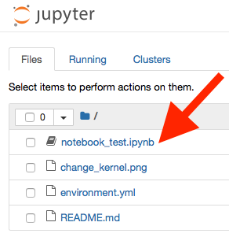
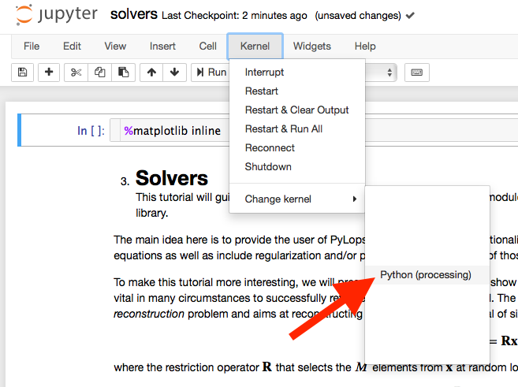
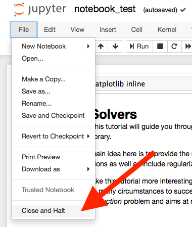
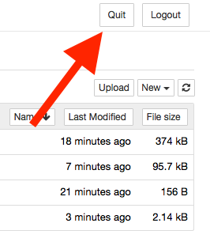

# Python setup for course
Template repository to help students set up a working Python environment.

## Step 1
You first need to make sure that a working Python environment is installed on
your computer. To do so, it is recommended to
[download](https://www.anaconda.com/distribution/#download-section)
and install the Python Anaconda Distribution on your computer.
Information regarding the Anaconda installer are available for
[Windows](https://docs.anaconda.com/anaconda/install/windows/),
[macOS](https://docs.anaconda.com/anaconda/install/mac-os/),
and [Linux](https://docs.anaconda.com/anaconda/install/linux/).
During the installation process, when asked about advanced options,
accept the default choices.


## Step 2
After insalling the Anaconda distribution on your computer, you need to create a
**[conda environment](https://docs.conda.io/projects/conda/en/latest/user-guide/concepts/environments.html)**.
To do so, you first need to download the
[environment.yml file](environment.yml)
from this repository. Make sure you remember the folder where you download this
file. Then, you need to open a terminal window and do the following:

```shell
cd /folder_where_you_downloaded_environment.yml
conda update conda
conda env create -f environment.yml
conda activate processing

python -m ipykernel install --user --name processing --display-name "Python (processing)"
```
In the sequence of commands above, you need to replace
`/folder_where_you_downloaded_environment.yml` with the actual folder that
contains the downloaded `environment.yml` file.

## Step 3
To make sure that the conda environment has been correctly installed,
you should first start the Juypter server:

```shell
jupyter notebook
```

Then you need to open one of the provided Notebooks:



The first time you open a Notebook with this conda environment,
you will need to change the kernel. The screenshot below shows how to do so:



Once you are done working with a Notebook, you should save it and close it:



Finally, you can shutdown the Jupyter server:



# Need help?
If you any issues with the installation and validation process outlined above,
please contact [XXX](mailto:xx.xx@erdw.ethz.ch).
